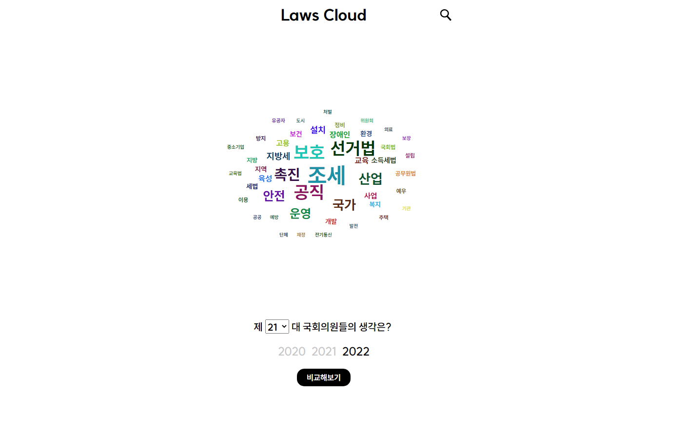
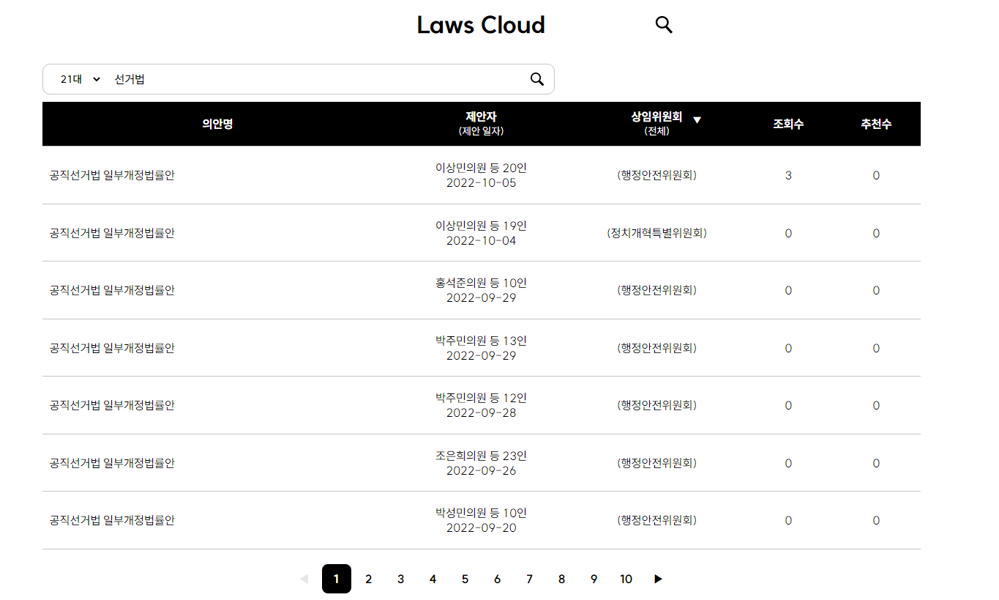

<h1> Laws Cloud </h1>

 2000년대 이후 법률 발의안들의 키워드들을 워드 클라우드로 보여주는 웹 어플리케이션입니다. 

<h3> Description of Project </h3>
<h3> 사이트 도메인 </h3>
<a href="lawsColud.top"> lawscolud.top </a>

 
 
 

<h2><b> Preview </b></h2> 
<h3><b> 메인 페이지 </b></h3>

   
<h3><b> 비교 페이지 </b></h3>

   
<h3><b> 법률안 페이지 </b></h3>

   
<h3><b> 법률안 상세페이지 </b></h3>

### Tech Stacks

<!-- JavaScript -->

<!-- React -->

<!-- Recoil -->

<!-- Styled Components -->

<!-- FireBase -->

### Crew Info

| TEAM   | Position | Github                                                      |
| ------ | -------- | ----------------------------------------------------------- |
| 이승훈 | FrontEnd | <a href="https://github.com/mandarin-sep">@mandarin-sep</a> |
| 김관우 | FrontEnd | <a href="https://github.com/kykson2">@kykson2</a>           |
| 우인우 | FrontEnd | <a href="https://github.com/wooinwoo">@wooinwoo</a>         |
| 정영훈 | FrontEnd | <a href="https://github.com/young-st511">@young-st5111</a>  |

