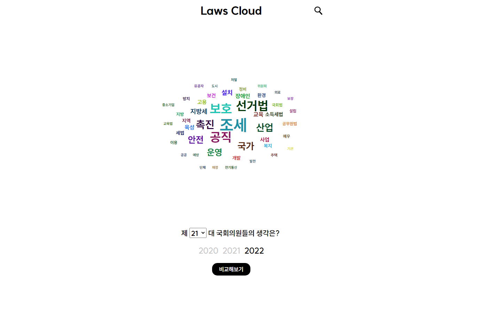
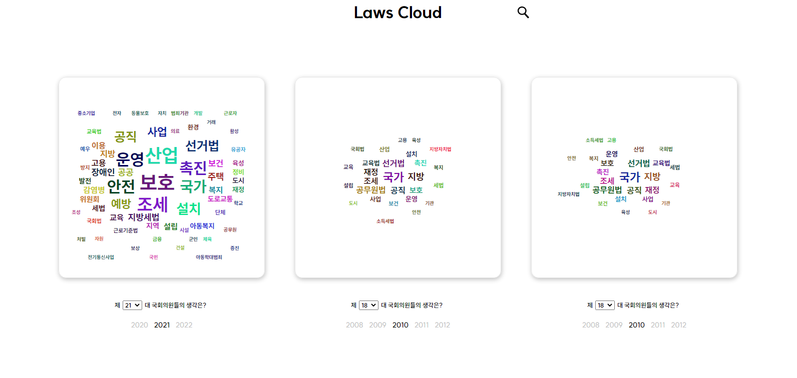
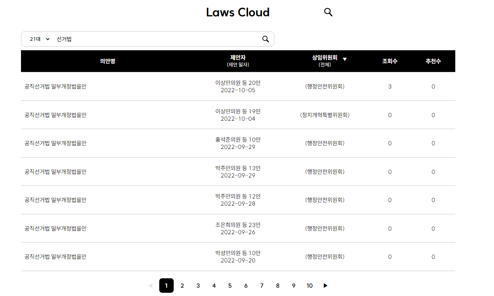
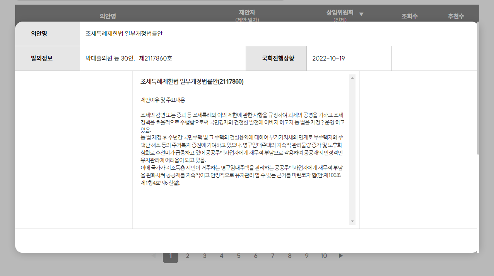

# 배포사이트 | [🔗Link](https://laws-cloud-dsklmlm35-young-st511.vercel.app)

---

# Laws Cloud

## Table of Content

1. [프로젝트 개요](#프로젝트-개요)
2. [프로젝트 소개](#🏗️-프로젝트-소개)
   1. [메인페이지](#메인-페이지)
   2. [비교페이지](#비교-페이지)
   3. [법률안페이지](#법률안-페이지)
   4. [법률안 상세페이지](#법률안-상세페이지)

## 프로젝트 개요

- 2000년대 이후 법률 발의안들의 키워드들을 워드 클라우드로 보여주는 웹 어플리케이션입니다.
- 3개의 발의안을 비교해 볼 수 있습니다.
- 발의안의 상세 정보를 조회하고 코멘트를 남길 수 있습니다.

### Why?

- 각 연도별 국회의원들의 관심사에 대한 키워드를 한눈에 파악할 수 있음
- 특정 연도(국회 기수) 별로 조회 및 비교가 가능하여 해당 연도 국회, 즉 민심의 방향이 어떠했는지 가늠해 볼 수 있음.

 
 

## 🏗️ 프로젝트 소개

### 메인 페이지

   

### 비교 페이지

   

### 법률안 페이지

   

### 법률안 상세페이지

---

### ⚙️ Tech Stacks

### Crew Info

| TEAM   | Position | Github                                                      |
| ------ | -------- | ----------------------------------------------------------- |
| 이승훈 | FrontEnd | <a href="https://github.com/mandarin-sep">@mandarin-sep</a> |
| 김관우 | FrontEnd | <a href="https://github.com/kykson2">@kykson2</a>           |
| 우인우 | FrontEnd | <a href="https://github.com/wooinwoo">@wooinwoo</a>         |
| 정영훈 | FrontEnd | <a href="https://github.com/young-st511">@young-st5111</a>  |

